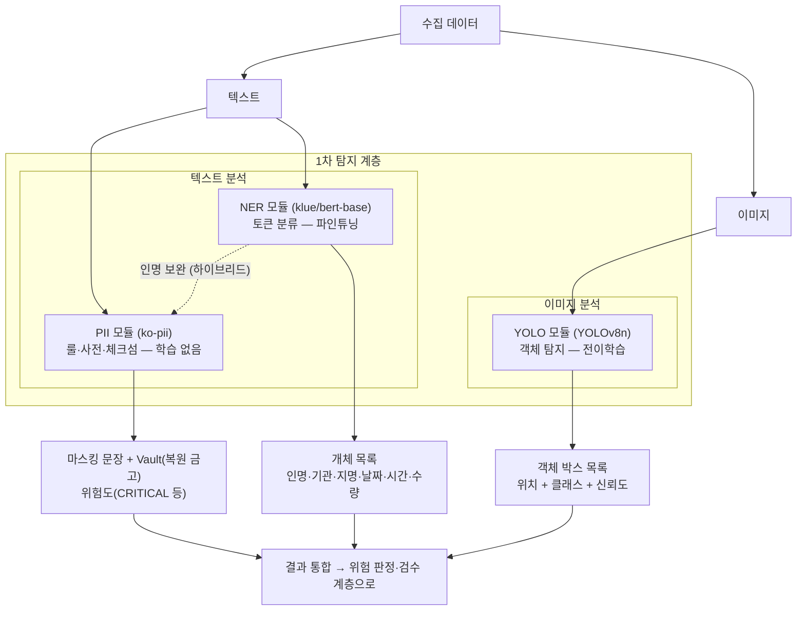
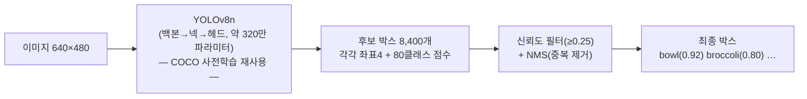
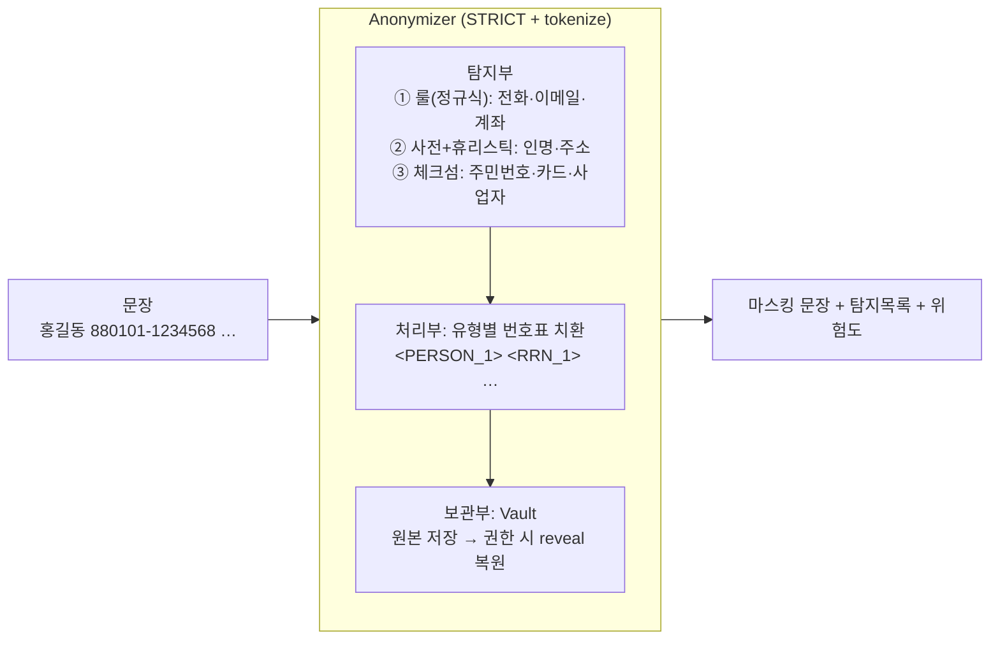
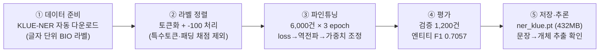
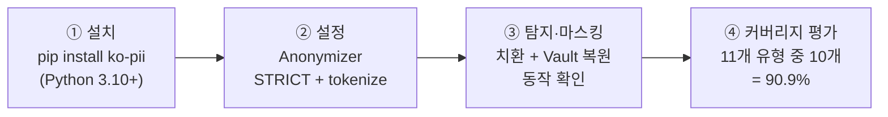

# 도식도 — NER · YOLO · PII 아키텍처 & 처리 흐름

작성일: 2026-07-08 · 1~4종 산출물의 보강(5/5) · 수치는 실측(2026-07-05 로컬 M4 Max/MPS)

---

## 1. 통합 아키텍처도 — 세 모듈이 탐지 파이프라인에서 서는 자리



```
[텍스트 없이 보는 판]

수집 데이터
 ├─ 텍스트 ─┬─ [PII: ko-pii 룰+사전+체크섬] ──→ 마스킹 문장 + Vault + 위험도
 │          └─ [NER: klue/bert-base 토큰분류] ─→ 개체 목록 (인명·기관·지명…)
 │                └······ 인명 보완 (하이브리드: 룰의 인명 미탐을 NER이 메움)
 └─ 이미지 ─── [YOLO: YOLOv8n 객체탐지] ─────→ 박스 목록 (위치+클래스+신뢰도)
                                  ↓
                    결과 통합 → 위험 판정·검수 (후속 계층)
```

- **분업**: 텍스트는 PII(형식 있는 개인정보)와 NER(문맥 의존 개체)이 나눠 맡고, 이미지는 YOLO가 맡는다.
- **하이브리드 근거(실측)**: PII 룰은 주민번호·전화(체크섬·형식)에 강하나 인명에서 미탐 발생(김영희) → 인명은 NER이 보완.

---

## 2. 모델별 아키텍처도 (내부 구조)

### 2-1. NER — BERT 본체 + 토큰 분류층


- 13 = 6개 유형(인명 PS·지명 LC·기관 OG·날짜 DT·시간 TI·수량 QT) × 시작 B/이어짐 I + 개체아님 O.
- 전이학습: 본체(1.1억 파라미터)는 재사용, 분류층만 새로 얹어 소량 데이터로 미세조정.

### 2-2. YOLO — 사전학습 탐지기 전이



- 박스 = 중심x·중심y·너비·높이(이미지 대비 비율) + 클래스 + 신뢰도.
- 신뢰도 = 80클래스 점수 중 최고값(로짓→시그모이드).

### 2-3. PII — 규칙 엔진 (학습 없음)



- 33개 PII 범주. 체크섬 = 수학 검증(예: 주민번호 앞 12자리 가중합 mod 11 → 끝자리 일치)으로 오탐 억제.

---

## 3. 프로세스 처리 흐름 단계 도식도 (R&D 수행 절차)

### 3-1. NER (학습형)



### 3-2. YOLO (전이학습형)


### 3-3. PII (통합형 — 학습 단계 없음)



### 세 흐름 비교 (한눈에)

| 단계 | NER | YOLO | PII |
|---|---|---|---|
| 준비 | 데이터 자동DL + 라벨 정렬 | 가중치·데이터 자동DL | 설치만 |
| **학습** | ✅ 파인튜닝 (3 ep) | ✅ 전이학습 (1 ep) | **없음** (룰 기반) |
| 평가 | 엔티티 F1 **0.7057** | mAP50 **0.606** | 커버리지 **90.9%** |
| 산출물 | ner_klue.pt | yolo_best.pt | (가중치 없음) |
| 실전 확장 | 도메인 라벨 재학습 | 커스텀 데이터 전이 | NER 하이브리드 |

---

> 도식은 Mermaid 형식 — Notion·GitHub·VS Code(미리보기)에서 그림으로 렌더링됩니다.
> 상세 수치·재현 절차는 1_연구문서 / 3_사용법 / 4_가이드 참조.
