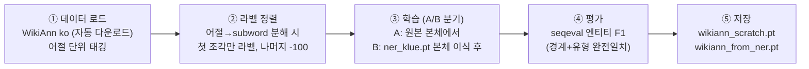

# 전이학습 R&D 보고서 — NER(토큰 분류) 출발점 전략 검증

작성일: 2026-07-08 · 검증 환경: macOS Apple Silicon(M4 Max, MPS) · Python 3.12 / torch 2.12.1 / transformers 5.13.0

---

## 1. 수행기간

**2026-07-05 ~ 2026-07-07 (3일)** — 로컬 환경 완결 (별도 GPU·클라우드 비용 없음)

| 일자 | 수행 내용 |
|---|---|
| 07-05 | NER 기초 R&D — klue/bert-base + KLUE-NER 파인튜닝 (선행 실험) |
| 07-07 | 전이 사슬 A/B 대조 실험 — WikiAnn ko, 출발점 전략 비교 |

## 2. 목표 및 목적

- **목표**: BERT 본체 + 분류층(classification head) 구조의 토큰 분류 모델에서, 하류 학습(downstream fine-tuning)의 **출발 가중치 전략을 실측으로 검증**한다.
- **목적**: 탐지 플랫폼의 NER 계층을 업무 도메인 데이터로 구축하기 전에, "**어느 가중치에서 출발해 파인튜닝할 것인가**"의 기본 전략을 근거와 함께 확정 — 도메인 학습 착수 시 시행착오 비용을 제거.

## 3. Why · How · What

**Why (왜 필요한가)**
- 사전학습 모델(klue/bert-base)은 **본체(backbone)만 제공** — 분류층은 체크포인트에 존재하지 않아 로드 시 난수 초기화됨(가중치 로드 리포트의 MISSING 상태). 따라서 하류 과제 학습이 필수.
- 이때 본체의 출발점 선택지가 둘: ① 범용 사전학습 원본 ② 기존 과제 완제품(ner_klue.pt)의 본체 재활용(전이 사슬). 직관만으로는 우열을 판단할 수 없어 대조 실험 필요.

**How (어떻게 검증했나)**
- **같은 데이터·같은 조건·같은 시드**에서 출발점만 바꾼 A/B 대조 실험 설계.
- 새 데이터: WikiAnn ko — 어절 단위(word-level) 태깅, 3개체(PER·ORG·LOC), 학습 8,000건.
- 기술 요소: 분류층은 태그 체계 불일치(13칸↔7칸)로 이식 불가 → **부분 로드**(partial loading, `strict=False`)로 본체만 이식.

**What (무엇을 얻었나)**
- 전이 1회(원본 출발) vs 전이 사슬 2회차(완제품 본체 출발)의 성능 실측 비교표.
- 실무 기본값 도출: **"새 과제는 범용 사전학습 본체에서 새로 파인튜닝"**.

## 4. 수행 과정

### 4-1. 처리 흐름 단계



```
[텍스트 판]
데이터 로드 → 어절-subword 정렬(-100) → 학습(출발점 A/B) → 평가(F1) → 가중치 저장
```

### 4-2. 라벨 체계 (ENUM)

WikiAnn 7태그 — 토큰마다 아래 번호 중 하나를 예측:

| 코드 | 라벨 | 의미 |
|---|---|---|
| 0 | O | 개체 아님 |
| 1 / 2 | B-PER / I-PER | 인명 시작 / 이어짐 |
| 3 / 4 | B-ORG / I-ORG | 기관 시작 / 이어짐 |
| 5 / 6 | B-LOC / I-LOC | 지명 시작 / 이어짐 |

(선행 실험 KLUE-NER은 6개체×B/I+O = 13태그 — 동일 구조의 확장판)

### 4-3. 가중치 로드 상태 (상태코드)

`from_pretrained` 로드 리포트의 상태 3종 — 전이학습의 정상 동작:

| 상태 | 의미 | 본 실험에서 |
|---|---|---|
| **LOADED** | 체크포인트에서 정상 이식 | 본체 197개 텐서 (~1.1억 파라미터) |
| **UNEXPECTED** | 파일에 있으나 새 구조에 자리 없음 → 폐기 | 사전학습용 head (MLM·NSP·pooler) |
| **MISSING** | 새 구조에 자리 있으나 파일에 없음 → 난수 초기화 | 분류층 (`classifier.weight/bias`) — **하류 학습 필요의 근원** |

### 4-4. 실험 구성

| | 실험 A | 실험 B (전이 사슬) |
|---|---|---|
| 본체 출발점 | klue/bert-base 원본 | **ner_klue.pt** (KLUE-NER 학습 완료분)의 본체 |
| 분류층 | 7칸 난수 신규 | 7칸 난수 신규 (13칸은 체계 불일치로 제외) |
| 학습 조건 | WikiAnn 8,000건 × 2 epoch, lr 5e-5, seed 123 | **동일** |
| 산출물 | wikiann_scratch.pt | wikiann_from_ner.pt |

## 5. 수행 결과 (성과 지표)

**선행 실험 (KLUE-NER, 07-05)**: 엔티티 F1 **0.7057** (6,000건×3ep, 검증 1,200건) — 파이프라인 유효성 확인.

**본 실험 (WikiAnn ko, 검증 1,600건 · 개체 2,245개)**:

| 지표 | 실험 A (원본 출발) | 실험 B (사슬) | 차이 |
|---|---|---|---|
| **엔티티 F1** | **0.8447** | 0.8317 | −0.0130 |
| LOC (지명) | 0.9084 | 0.8960 | −0.0124 |
| ORG (기관) | 0.7485 | 0.7366 | −0.0119 |
| PER (인명) | 0.8685 | 0.8536 | −0.0149 |

**판독**
- 전이 사슬(B)의 **추가 이득이 확인되지 않음** — 전 클래스에서 일관되게 근소 열세.
- 해석: ① 기존 완제품의 본체는 이전 과제(뉴스 도메인·글자 단위)에 특화된 상태라 다른 분포(위키·어절 단위)에서 이점이 없음 ② 하류 데이터가 충분(8천 건)하면 출발점 이점이 학습 과정에서 상쇄됨.
- 단서: 단일 시드 실험이며 차이(0.013)가 크지 않음 — "사슬이 나쁘다"가 아니라 "**사슬의 추가 이득 미확인**"이 정확한 결론.
- 부수 성과: 어절 단위(word-level) 데이터에서 subword 정렬(-100) 로직의 실전 검증 완료 (F1 0.84가 정렬 정확성의 방증).

## 6. 기대 효과

1. **도메인 NER 구축 전략 확정**: 업무 도메인 데이터 확보 시, 기존 모델에서 잇지 않고 **범용 본체(klue/bert-base)에서 새로 파인튜닝**을 기본값으로 — 관리 단순 + 성능 동등 이상.
2. **재현 가능한 토큰 분류 파이프라인**: 글자 단위(KLUE)·어절 단위(WikiAnn) 두 라벨 체계 모두 검증 완료 — 도메인 데이터가 어느 형식이든 즉시 적용 가능.
3. **비용 효율**: 전 과정 로컬 완결 (실험 1회당 십수 분, 클라우드 비용 0).

## 7. 산출물

| 구분 | 파일 | 비고 |
|---|---|---|
| 실험 코드 | `finetune_wikiann.py` | INIT_FROM 환경변수로 A/B 전환 |
| 선행 코드 | `finetune_ner.py` · `ner_dataset.py` | 정렬·평가 모듈 재사용 |
| 가중치 | wikiann_scratch.pt · wikiann_from_ner.pt · ner_klue.pt | 각 ~420MB (요청 시 전달) |
| 문서 | 본 보고서 + 기존 1~5호 (연구·소스·사용법·가이드·도식도) | |
| 환경 | requirements.txt (버전 고정) · README 윈도우/맥 | 기존 배포분 |

## 8. 향후계획

1. **업무 도메인 전이 (본 목적)**: 도메인 라벨 데이터 확보 시 동일 파이프라인으로 즉시 파인튜닝 — 본 실험이 확정한 기본값(원본 출발) 적용.
2. **소량 데이터 조건 재검증**: 도메인 라벨이 수백 건 수준이면 사슬 전략이 유리할 가능성 있음(출발점 이점이 상쇄되지 않는 조건) — 데이터 확보 후 A/B 재실행으로 확인.
3. **하이브리드 구성**: 룰 기반 PII(ko-pii)와 NER의 결합 — 형식류(주민번호·전화)는 룰, 문맥류(인명·기관)는 NER 분담.
4. **정식 학습**: 전체 데이터·에폭 확대 및 공식 벤치마크 기준 성능 확인.
