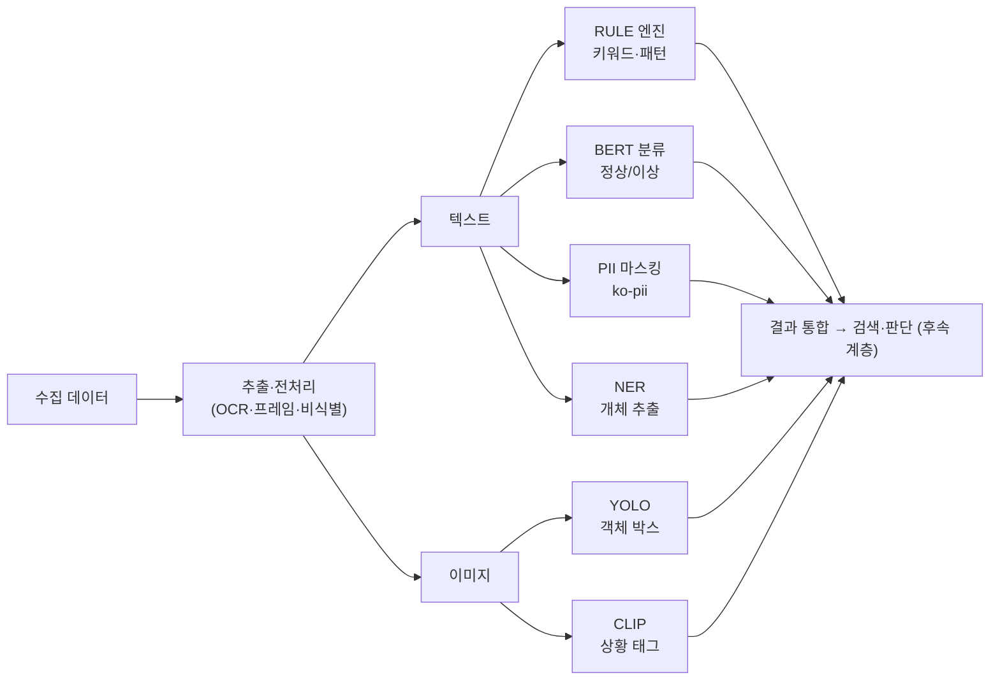
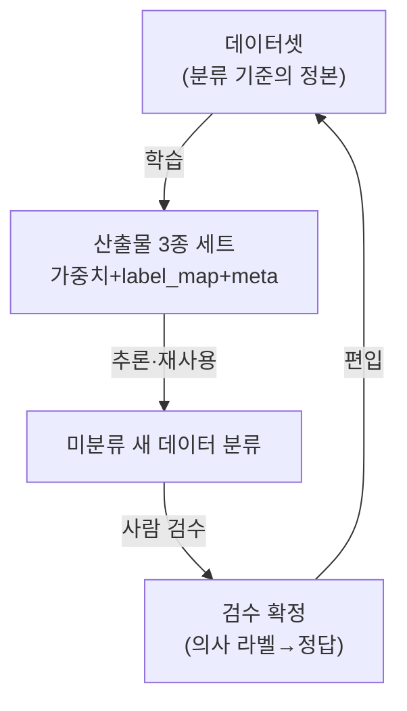
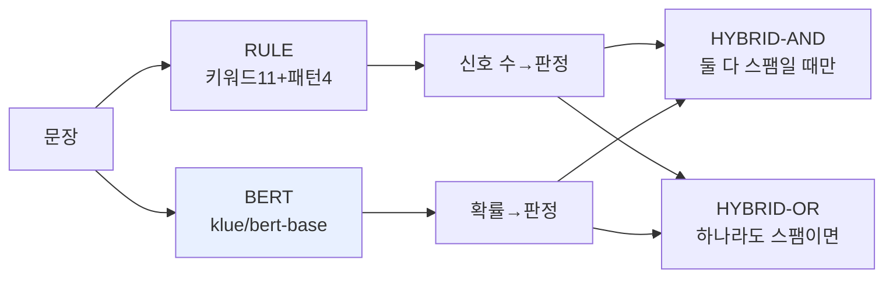
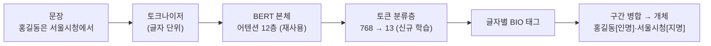
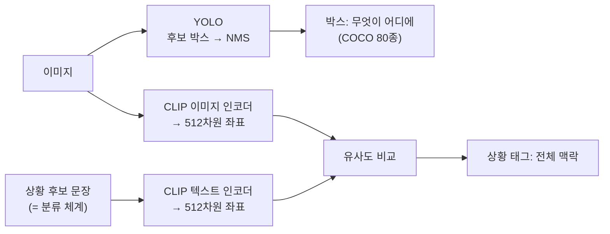
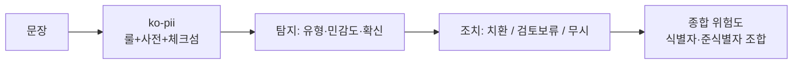
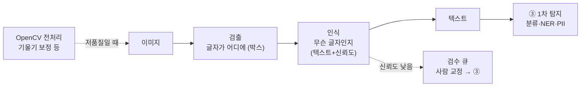
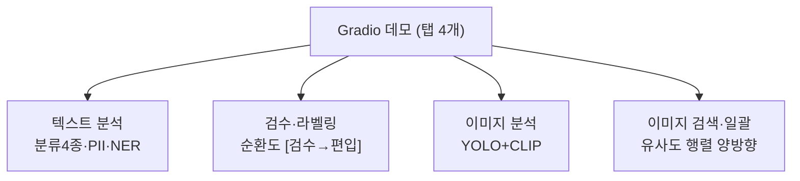

# 5. 도식도 — 탐지 계층 아키텍처 & 처리 흐름

> mermaid 블록은 보고서 변환 시 PNG로 렌더링됨. 각 도식 아래 `[텍스트 판]`은 이미지 없이도 읽히는 대체본.

## 1. 통합 아키텍처 — 1차 탐지 계층에서 모듈이 서는 자리



```
[텍스트 판]
수집 → 추출/전처리 → ┬ 텍스트 → RULE·BERT분류·PII·NER
                     └ 이미지 → YOLO·CLIP        ──→ 결과 통합(후속: 검색·판단)
```

- 텍스트 4모듈·이미지 2모듈이 **1차 탐지**를 분담. 도메인(성착취물·도박 등) 교체는 데이터·프롬프트·룰셋만 바꿈.

## 2. 데이터 순환 — 학습 데이터 산출물 환경



```
[텍스트 판]
데이터셋 → (학습) → 산출물 3종 세트 → (재사용) → 새 데이터 분류 → (검수) → 데이터셋 편입 → 반복
```

- 가중치는 데이터+코드로 재생성 가능, 데이터셋(특히 직접 라벨링)은 재생성 불가 → **데이터셋이 1급 자산**.

## 3. 모듈별 구조

### 3-1. 텍스트 분류 — RULE vs BERT vs 하이브리드



```
[텍스트 판]
문장 → RULE 판정 + BERT 판정 → 조합: AND(만장일치=오탐0 지향) / OR(한 표=미탐 최소 지향)
```

### 3-2. NER — BERT 본체 + 토큰 분류층



```
[텍스트 판]
문장 → 토크나이저(글자) → BERT 본체 → 분류층(768→13) → 글자별 BIO → 구간 병합 → 개체 목록
```

### 3-3. 이미지 — YOLO(위치) + CLIP(상황)



```
[텍스트 판]
이미지 →┬ YOLO → 박스(무엇이 어디에, 학습된 80종)
         └ CLIP: 이미지·후보문장을 같은 좌표계로 → 가장 닮은 상황 (프롬프트 교체=체계 교체)
```

- YOLO=국소(위치가 출력, 가중치에 클래스 고정) / CLIP=전역(분위기가 출력, 프롬프트에 체계).

### 3-4. PII — 규칙 엔진 (학습 없음)



```
[텍스트 판]
문장 → ko-pii(룰+체크섬) → 탐지(유형·민감도) → 조치(치환/검토/무시) → 문장 단위 종합 위험도
```

### 3-5. OCR — 검출+인식, 추출 계층(②)



```
[텍스트 판]
이미지 → (전처리: 기울기 보정 등) → 검출(어디에) → 인식(무엇) → 텍스트 → ③ 1차 탐지
                                        └ 신뢰도 낮으면 검수 큐 → 사람 교정 → ③
```

- **②추출 품질 = ③탐지 성능**: 한 글자 오독이 PII 전멸로 이어짐(실측). 방어선 3층 = 전처리·신뢰도 검수·두 엔진 교차 검증.

## 4. 통합 데모 — 모듈 통합



```
[텍스트 판]
데모 탭 4개: ① 텍스트(분류4종·PII·NER) ② 검수·라벨링(자산화) ③ 이미지(YOLO+CLIP) ④ 이미지 검색·일괄
```
