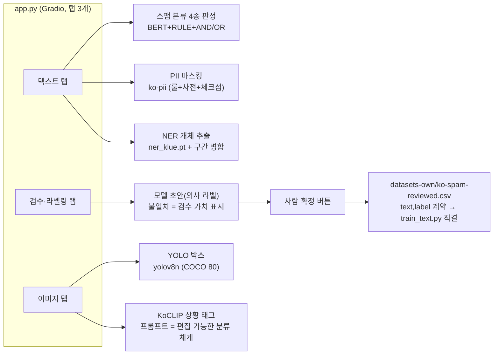

# 01 구성도 — 탐지 AI 통합 데모 (지시 3, 2026-07-10)

> R&D 아닌 **제작** — 신규 학습 0, 완료된 지시 1·2·4 산출물의 조립. 실행법은 [[02-사용법]].

## 모듈 연결도

## 재사용 관계 (산출물의 출처)

| 데모 기능 | 재사용 산출물 | 출처 R&D |
|---|---|---|
| BERT 스팸 분류 | `artifacts/ko-spam-full/` 3종 세트 | [[../rnd-dataset-artifacts/01-연구문서\|지시 1]] (학습기) + [[../rnd-rule-vs-bert/01-연구문서\|지시 2]] (풀 학습) |
| RULE·하이브리드 | `rule_spam.py` (키워드 11+패턴 4) | 지시 2 — 4종 판정이 곧 "선택지 메뉴"의 UI화 |
| PII 마스킹 | ko-pii `Anonymizer` | NER·YOLO·PII R&D ([[../rnd-detection-models/01-연구문서]]) |
| NER 개체 | `ner_klue.pt` + `predict_ner.py` | 〃 (엔티티 F1 0.7057) |
| YOLO 박스 | `yolov8n.pt` | 〃 |
| KoCLIP 상황 태그 | `Bingsu/clip-vit-base-patch32-ko` | [[../rnd-clip/01-연구문서\|지시 4]] (한국어 0.8519 최고) |

## 검수·라벨링 탭 — 순환도 마지막 화살표의 실체화

지시 1 순환도의 `분류 결과 ──[검수]──▶ 데이터셋 편입`을 UI로 구현 (의사 라벨링의 실무 형태):

- **모델 판정 = 초안**: BERT·RULE 제안을 보여주되, 저장은 사람의 확정 버튼으로만 (정답 가족은 사람이 만든다)
- **불일치 우선**: 두 방법이 갈리면 "검수 가치 최고" 경고 — 능동 학습의 우선순위 감각
- **출력 계약 = 학습기 입력 계약**: 확정분은 `rnd-dataset-artifacts/export/datasets-own/ko-spam-reviewed.csv`
  (text,label + 초안·확신·검수일 이력, git 추적 자산)에 편입 → `DATA=` 지정만으로 재학습 가능 — **순환 폐쇄**
- 중복 문장 저장 방지, "사람이 초안을 뒤집은 건수" 집계(모델-사람 불일치율의 싹)

## 설계 결정 3가지

1. **지연 로딩** — 모델 5개(BERT 420MB·NER 420MB·KoCLIP 등)를 시작 시가 아니라 탭별 첫 사용 시 로딩.
2. **스팸 판정을 4종 병렬 표시** — 지시 2의 결론("단일 승자 없음, 업무 요구별 선택")을 UI가 그대로 보여줌.
3. **CLIP 프롬프트를 편집창으로** — 분류 체계 교체(재학습 없음)가 CLIP을 고른 이유이므로 UI에서 체험 가능하게.

## 남은 검증 (완료 조건)

- 실전 프롬프트 재확정 — coco128이 아닌 자체/도메인 이미지에서 (지시 4 학습메모 #10의 처방)
- PII 오탐 확인됨: "당첨"→PERSON — 룰 기반의 문맥맹 실사례 (NER 하이브리드 보완 근거 그대로)
